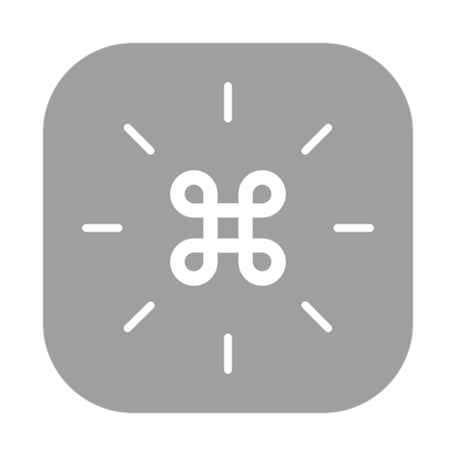
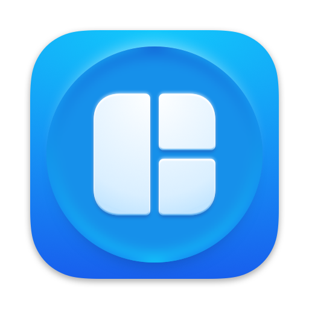
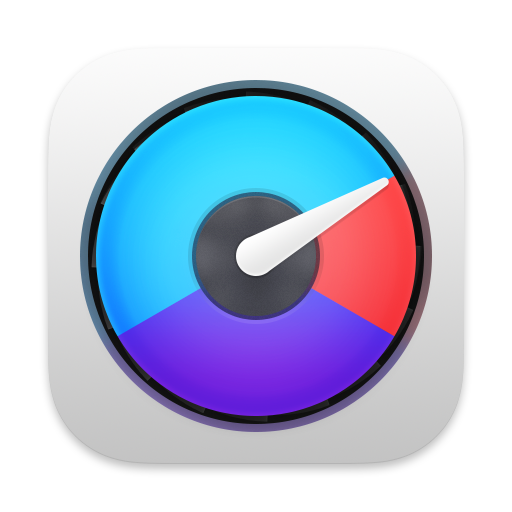
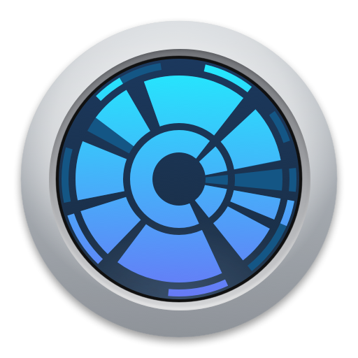
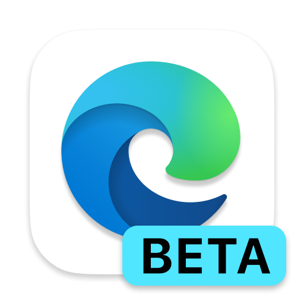
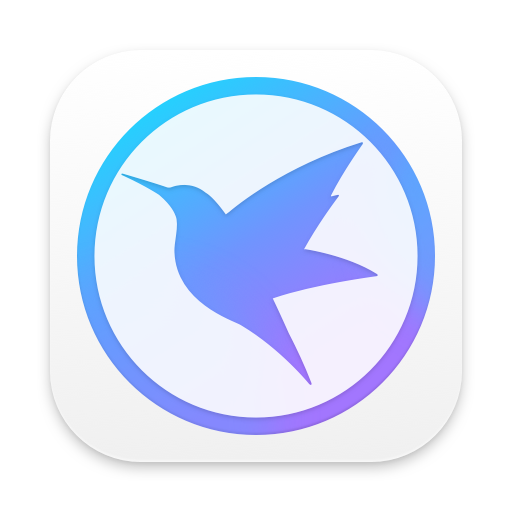
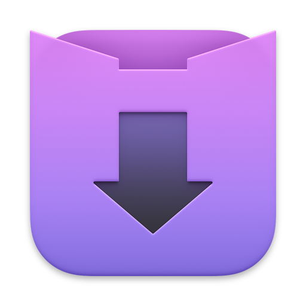
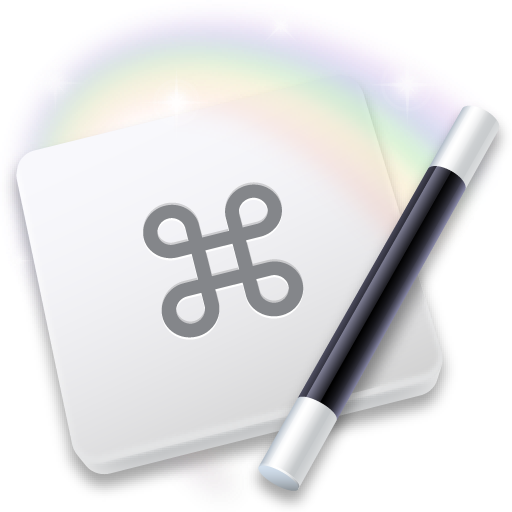
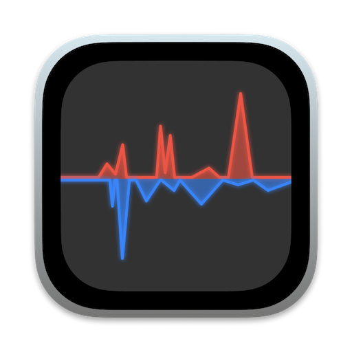

### Mac工具推荐

> 包含收费与未收费，工具相关链接仅提供官方地址

| 分类         | 工具名称                                                       |
| :------------- | :----------------------------------------------------------: |
| 深度卸载       | [App Cleaner & Uninstaller](https://nektony.com/mac-app-cleaner) |
| 优化清理       | [CleanMyMac X](https://cleanmymac.com/) [**腾讯柠檬**](https://lemon.qq.com/) |
| 视频播放       | [**IINA**](https://www.iina.io/?source=https://macwk.com/soft/iina) [Infuse Pro](https://apps.apple.com/cn/app/id1136220934#?platform=mac) [VLC](http://www.videolan.org/vlc/) |
| 解压缩         | [**Keka**](https://www.keka.io/zh-cn/) [MacZip](https://ezip.awehunt.com/) |
| 翻译           | [欧路词典](https://apps.apple.com/cn/app/id402380914?mt=12) |
| 快捷键提示     | [CheatSheet](https://mediaatelier.com/) |
| 启动器 | [**Alfred**](https://www.alfredapp.com/) [Raycast](https://www.raycast.com/) |
| 剪贴板历史     | [Paste](https://apps.apple.com/cn/app/id967805235) |
| 窗口管理       | [**Magnet**](https://magnet.crowdcafe.com/) [Rectangle](https://rectangleapp.com/) |
| 屏幕保护程序   | [Aerial](https://github.com/JohnCoates/Aerial) |
| 菜单栏图标整理 | [Bartender](https://www.macbartender.com/Bartender4/) |
| 文件临时存放   | [Yoink](https://apps.apple.com/cn/app/yoink/id457622435?mt=12) |
| 截图/贴图    | [Snipaste](https://zh.snipaste.com/) |
| 截图/长截图 | [**iShot**](https://apps.apple.com/cn/app/id1485844094) [Xnip](https://apps.apple.com/cn/app/xnip/id1221250572) |
| 顶层窗口高亮   | [HazeOver](https://apps.apple.com/cn/app/id430798174) |
| 壁纸           | [pap.er](http://paper.meiyuan.in/) |
| 右键菜单       | 超级右键                                                     |
| OCR工具        | [Text Scanner](https://apps.apple.com/cn/app/id1452523807) |
| 系统监控 | [iStat Menus](https://bjango.com/mac/istatmenus/) |
| 虚拟机         | [Parallels Desktop](https://www.parallels.com/cn/products/desktop/pro/) |
| 广告屏蔽       | [Adguard](https://adguard.com/zh_cn/welcome.html) |
| 磁盘清理 | [Daisydisk](https://daisydiskapp.com/) |
| 小窗口浏览器   | [MenubarX](https://menubarx.app/) |
| 远程控制       | [ToDesk](https://www.todesk.com/) [**向日葵**](https://sunlogin.oray.com/default) [TeamViewer](https://www.teamviewer.cn/cn/) |
| 快速设置深色模式 | [NightOwl](https://nightowl.kramser.xyz/) |
| 抓包工具 | [Charles](https://www.charlesproxy.com/) |
| 密码管理 | [Bitwarden](https://bitwarden.com/) |
| 微博 | [Maipo](https://apps.apple.com/cn/app/weibox/id789066512?ls=1&mt=12) |
| mac助手 | [macOS小助手](https://www.macwk.com/) |
| mardown编辑器 | [Typora](https://www.typora.io/) [MWeb](https://apps.apple.com/cn/app/id1403919533?mt=12) |
| 文本编辑器 | [Visual Studio Code](https://code.visualstudio.com/) [**Sublime Text**](http://www.sublimetext.com/) |
| PDF编辑器 | [PDF Expert](https://pdfexpert.com/) |
| 浏览器 | [**Edge**](https://www.microsoftedgeinsider.com/zh-cn/download/) [**Chrome**](https://www.google.com/chrome/) |
| SSH客户端 | [Termius](https://www.termius.com/) [**iTerm**](https://gitlab.com/gnachman/iterm2/) [Transmit](https://www.panic.com/transmit/) |
| 下载工具 | [迅雷](https://www.xunlei.com/) [Downie](https://software.charliemonroe.net/downie/) |
| 数据库管理 | [Navicat Premuim](https://www.navicat.com/en/products/navicat-premium) |
| Java开发工具 | [IntelliJ IDEA](https://www.jetbrains.com/idea/) |
| 图片浏览 | [Picsee](https://apps.apple.com/cn/app/id1454805783?mt=12) |
| office办公 | [WPS](https://www.wps.cn/) |
| 包管理器 | [Homebrew](https://brew.sh/index_zh-cn) |
| 鼠标平滑滚动 | [Mos](https://mos.caldis.me/) |
| 防休眠 | [Caffeinated](https://apps.apple.com/cn/app/caffeinated-anti-sleep-app/id1362171212) |
| 键盘修改 | [Karabiner Elements](https://karabiner-elements.pqrs.org/) |
| 自动化 | [Keyboard Maestro](http://www.keyboardmaestro.com/main/) |
| RSS阅读器 | [Reeder](https://reederapp.com/) |
| 自动切换输入法 | [KeyboardHolder](https://keyboardholder.leavesc.com/zh-cn/) |
| shell工具 | [Zsh](https://ohmyz.sh/) |
| git管理 | [SourceTree](https://www.sourcetreeapp.com/) |
| 网速显示 | [Stats](https://github.com/exelban/stats/releases) [ITraffic](https://github.com/foamzou/ITraffic-monitor-for-mac) |
| 隐藏菜单栏图标 | [Dozer](https://github.com/Mortennn/Dozer) |
| 文件自动化管理 | [Hazel](https://www.noodlesoft.com/) |
| 微信多开/防撤回 | [WeChatTweak](https://github.com/Sunnyyoung/WeChatTweak-macOS) |
| 双向同步 | [Mackup](https://github.com/lra/mackup) |

