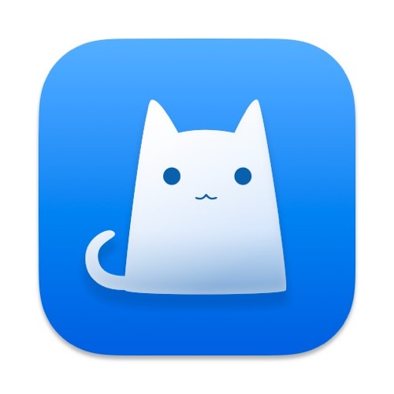
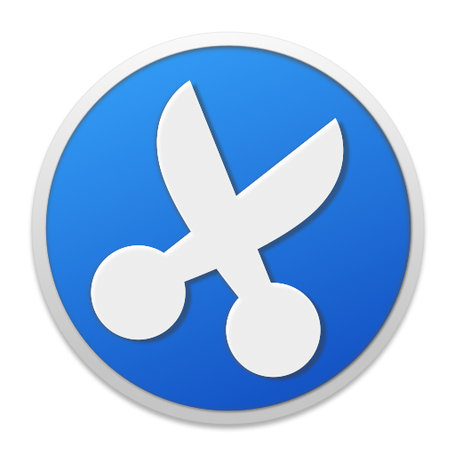
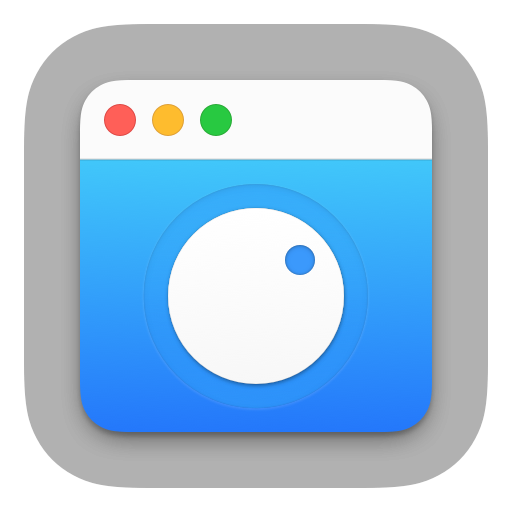
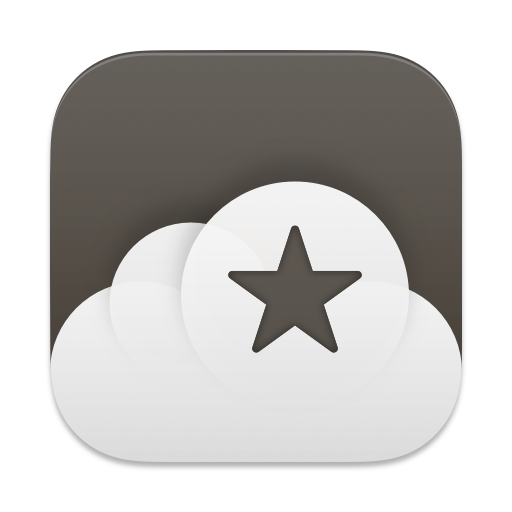

### Mac工具推荐

> 包含收费与未收费，工具相关链接仅提供官方地址

| 分类         | 工具名称                                                                                                                                                                                                                                                                                                                                                                                                                      |
|:-----------|:--------------------------------------------------------------------------------------------------------------------------------------------------------------------------------------------------------------------------------------------------------------------------------------------------------------------------------------------------------------------------------------------------------------------------|
| 浏览器        | [**Edge**](https://www.microsoftedgeinsider.com/zh-cn/download/)    [**Chrome**](https://www.google.com/chrome/)                                                                                                                                                    |
| 远程控制       | [ToDesk](https://www.todesk.com/)    [**向日葵**](https://sunlogin.oray.com/default)    [TeamViewer](https://www.teamviewer.cn/cn/)                                                 |
| 解压缩        | [**Keka**](https://www.keka.io/zh-cn/)    [MacZip](https://ezip.awehunt.com/)                                                                                                                                                                                       |
| office办公   | [WPS](https://www.wps.cn/)                                                                                                                                                                                                                                                                                                                         |
| 深度卸载       | [App Cleaner & Uninstaller](https://nektony.com/mac-app-cleaner)                                                                                                                                                                                                                                       |
| 截图/贴图      | [Snipaste](https://zh.snipaste.com/)                                                                                                                                                                                                                                                                                                     |
| 剪贴板历史      | [Paste](https://apps.apple.com/cn/app/id967805235)                                                                                                                                                                                                                                                                                             |
| 容器         | [Docker](https://docs.docker.com/desktop/install/mac-install/)                                                                                                                                                                                                                                                                               |
| 鼠标平滑滚动     | [Mos](https://mos.caldis.me/)                                                                                                                                                                                                                                                                                                                      |
| 包管理器       | [Homebrew](https://brew.sh/index_zh-cn)                                                                                                                                                                                                                                                                                                                                                                                   |
| shell工具    | [Zsh](https://ohmyz.sh/)                                                                                                                                                                                                                                                                                                                                                                                                           |
| 科学上网       | [ClashX](https://github.com/yichengchen/clashX/releases)                                                                                                                                                                                                                                                                                     |
| 自动切换输入法    | [KeyboardHolder](https://keyboardholder.leavesc.com/zh-cn/) [Input Source Pro](https://inputsource.pro/zh-CN)                                                                                                               |
| 虚拟机        | [Parallels Desktop](https://www.parallels.com/cn/products/desktop/pro/)                                                                                                                                                                                                                                                |
| 优化清理       | [CleanMyMac X](https://cleanmymac.com/)    [**腾讯柠檬**](https://lemon.qq.com/)                                                                                                                                                                            |
| Java开发工具   | [IntelliJ IDEA](https://www.jetbrains.com/idea/)                                                                                                                                                                                                                                                                               |
| 文本编辑器      | [Visual Studio Code](https://code.visualstudio.com/)    [**Sublime Text**](http://www.sublimetext.com/)                                                                                                                     |
| 数据库管理      | [Navicat Premuim](https://www.navicat.com/en/products/navicat-premium)                                                                                                                                                                                                                                                     |
| 屏幕保护程序     | [**Fliqlo**](https://magnet.crowdcafe.com/)    [Aerial](https://github.com/JohnCoates/Aerial)                                                                                                                                                                                                                                                |
| 翻译         | [欧路词典](https://apps.apple.com/cn/app/id402380914?mt=12)                                                                                                                                                                                                                                                                                          |
| 截图/长截图     | [**iShot**](https://apps.apple.com/cn/app/id1485844094)    [Xnip](https://apps.apple.com/cn/app/xnip/id1221250572)                                                                                                                                                    |
| 启动器        | [**Alfred**](https://www.alfredapp.com/)    [Raycast](https://www.raycast.com/)                                                                                                                                                                               |
| 快捷键提示      | [CheatSheet](https://mediaatelier.com/)                                                                                                                                                                                                                                                                                              |
| 窗口管理       | [**Magnet**](https://magnet.crowdcafe.com/)    [Rectangle](https://rectangleapp.com/)                                                                                                                                                                     |
| 菜单栏图标整理    | [Bartender](https://www.macbartender.com/Bartender4/)                                                                                                                                                                                                                                                                                  |
| 视频播放       | [**IINA**](https://www.iina.io/?source=https://macwk.com/soft/iina)    [Infuse Pro](https://apps.apple.com/cn/app/id1136220934#?platform=mac)    [VLC](http://www.videolan.org/vlc/) |
| 密码管理       | [Bitwarden](https://bitwarden.com/)                                                                                                                                                                                                                                                                                                    |
| 壁纸         | [pap.er](http://paper.meiyuan.in/)                                                                                                                                                                                                                                                                                                           |
| 文件临时存放     | [Yoink](https://apps.apple.com/cn/app/yoink/id457622435?mt=12)                                                                                                                                                                                                                                                                                 |
| 右键菜单       | [超级右键](https://apps.apple.com/cn/app/%E8%B6%85%E7%BA%A7%E5%8F%B3%E9%94%AE-irightmouse/id1497428978?mt=12)                                                                                                                                                                                                                                        |
| OCR工具      | [bob](https://bobtranslate.com/)                                                                                                                                                                                                                                                                                                                   |
| 顶层窗口高亮     | [HazeOver](https://apps.apple.com/cn/app/id430798174)                                                                                                                                                                                                                                                                                    |
| 系统监控       | [iStat Menus](https://bjango.com/mac/istatmenus/)                                                                                                                                                                                                                                                                                  |
| 广告屏蔽       | [Adguard](https://adguard.com/zh_cn/welcome.html)                                                                                                                                                                                                                                                                                          |
| mardown编辑器 | [Typora](https://www.typora.io/)    [MWeb](https://apps.apple.com/cn/app/id1403919533?mt=12)                                                                                                                                                                        |
| 磁盘清理       | [Daisydisk](https://daisydiskapp.com/)                                                                                                                                                                                                                                                                                                 |
| 快速设置深色模式   | [NightOwl](https://nightowl.kramser.xyz/)                                                                                                                                                                                                                                                                                                |
| 小窗口浏览器     | [MenubarX](https://menubarx.app/)                                                                                                                                                                                                                                                                                                        |
| 抓包工具       | [Charles](https://www.charlesproxy.com/)                                                                                                                                                                                                                                                                                                   |
| 微博         | [Maipo](https://apps.apple.com/cn/app/weibox/id789066512?ls=1&mt=12)                                                                                                                                                                                                                                                                           |
| mac助手      | [macOS小助手](https://www.macwk.com/)                                                                                                                                                                                                                                                                                                       |
| PDF编辑器     | [PDF Expert](https://pdfexpert.com/)                                                                                                                                                                                                                                                                                                 |
| SSH客户端     | [Termius](https://www.termius.com/)    [iTerm](https://gitlab.com/gnachman/iterm2/)    [Transmit](https://www.panic.com/transmit/)                                             |
| 下载工具       | [迅雷](https://www.xunlei.com/)    [Downie](https://software.charliemonroe.net/downie/)                                                                                                                                                                                   |
| 图片浏览       | [Picsee](https://apps.apple.com/cn/app/id1454805783?mt=12)                                                                                                                                                                                                                                                                                   |
| 防休眠        | [Caffeinated](https://apps.apple.com/cn/app/caffeinated-anti-sleep-app/id1362171212)                                                                                                                                                                                                                                               |
| 键盘修改       | [Karabiner Elements](https://karabiner-elements.pqrs.org/)                                                                                                                                                                                                                                                           |
| 自动化        | [Keyboard Maestro](http://www.keyboardmaestro.com/main/)                                                                                                                                                                                                                                                                 |
| RSS阅读器     | [Reeder](https://reederapp.com/)                                                                                                                                                                                                                                                                                                             |
| git管理      | [SourceTree](https://www.sourcetreeapp.com/)                                                                                                                                                                                                                                                                                         |
| 网速显示       | [Stats](https://github.com/exelban/stats/releases)    [ITraffic](https://github.com/foamzou/ITraffic-monitor-for-mac)                                                                                                                                         |
| 隐藏菜单栏图标    | [Dozer](https://github.com/Mortennn/Dozer)                                                                                                                                                                                                                                                                                                     |
| 文件自动化管理    | [Hazel](https://www.noodlesoft.com/)                                                                                                                                                                                                                                                                                                           |
| 微信多开/防撤回   | [WeChatTweak](https://github.com/Sunnyyoung/WeChatTweak-macOS)                                                                                                                                                                                                                                                                     |
| 双向同步       | [Mackup](https://github.com/lra/mackup)                                                                                                                                                                                                                                                                                                      |
| 全局代理       | [Proxifier](https://www.proxifier.com/)                                                                                                                                                                                                                                                                                                |
| 白噪音        | [Noizio](https://apps.apple.com/cn/app/id928871589?mt=12)                                                                                                                                                                                                                                                                                    |

