# 安装 iTerm2

[下载 iTerm2](https://iterm2.com/) 并安装 

使用 brew 安装：`brew install iterm2`

# 配置
首先设置 iTerm2 为默认终端  
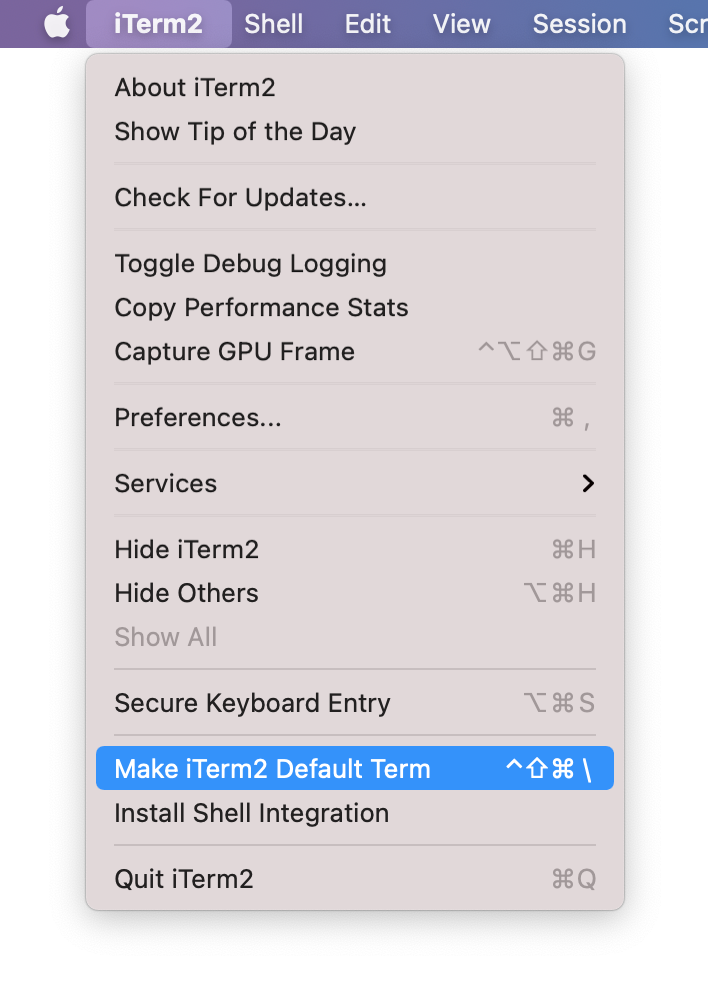
# 将默认 Shell 换为 zsh

先查询系统中所有的 shell：`cat /etc/shells`  
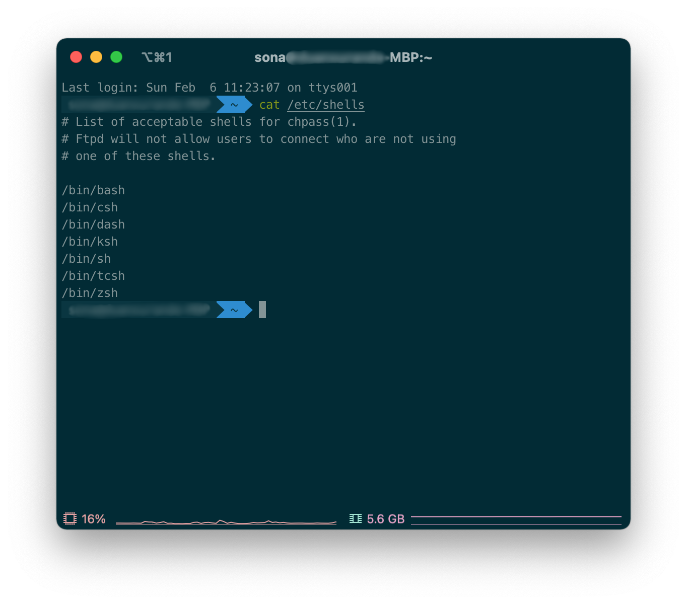
一般而言 Mac 的 Terminal 用的 Shell 是 bash，现在将其换成 zsh：`chsh -s /bin/zsh`

# 安装并配置 oh-my-zsh

## 安装 oh-my-zsh

oh-my-zsh 是一款基于 zsh 的，由社区驱动的命令行工具，我们接下来的很多配置要依赖其实现。

使用 curl 安装：
`sh -c "$(curl -fsSL https://raw.github.com/ohmyzsh/ohmyzsh/master/tools/install.sh)"`

或使用 wget 安装：

`sh -c "$(wget https://raw.github.com/ohmyzsh/ohmyzsh/master/tools/install.sh -O -)"`

如果你连不上 GitHub，也可以使用镜像站 https://gitee.com/mirrors/oh-my-zsh/blob/master/tools/install.sh 将上述安装方式的网址替换为这个即可。

## 安装字体

使用 brew 安装 nerd font 相关字体，下面我推荐一些常用的

```shell
brew install font-hack-nerd-font  
brew install font-jetbrains-mono-nerd-font  
brew install font-lxgw-wenkai  
brew install font-sauce-code-pro-nerd-font  
brew install font-ubuntu-mono-nerd-font
```

## 修改主题

在 iTerm2 中输入 `vim ~/.zshrc`

找到 ZSH_THEME 一行，将其修改为 `ZSH_THEME="agnoster"`

当然，你也可以修改为其他主题，不过后续配置操作可能会有所不同。[主题参考](https://github.com/ohmyzsh/ohmyzsh/wiki/themes)


打开 iTerm2 设置，`Profiles -> Text -> Font`，选择 `UbuntuMono Nerd Font Mono`，勾选 `Use a different font for non-ASClI text`，字体选 `Hack Nerd Font`，`Regular`字号看自己情况，我这里选的是 20。  
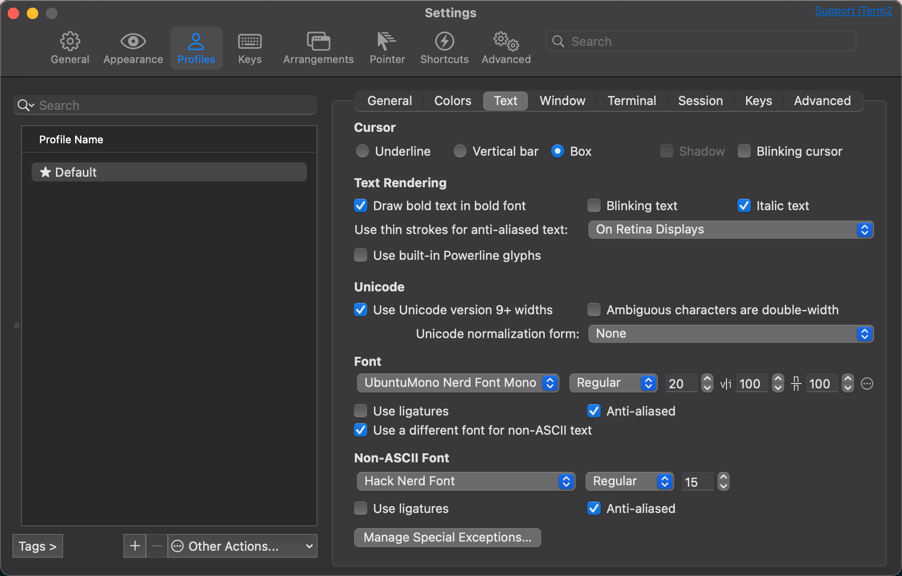


## 安装 powerlevel9k 主题

一步到位：
```shell
cd ~/.oh-my-zsh/custom/themes
git clone https://github.com/Powerlevel9k/powerlevel9k ${ZSH_CUSTOM:-~/.oh-my-zsh/custom}/themes/powerlevel9k
```

最后文件列表如下：
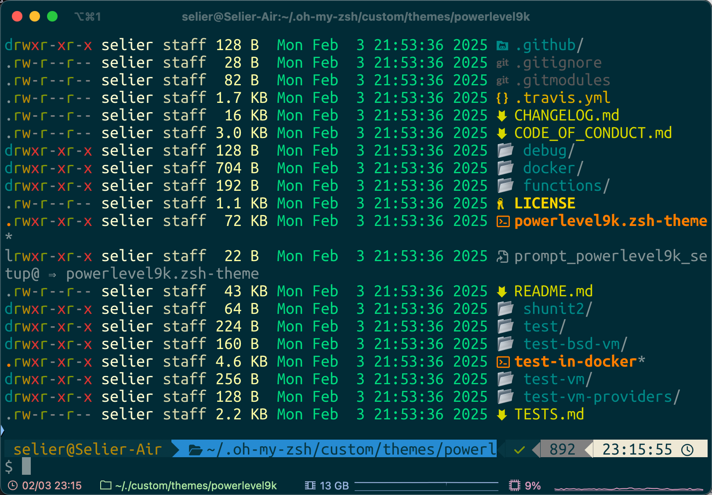

根据步骤：主题修改为：`ZSH_THEME="powerlevel9k/powerlevel9k"` ，source 一下zsh 配置文件即可


## 修改配色方案

[下载 Solarized](https://ethanschoonover.com/solarized/)，解压。

还是在 iTerm2 的设置里，`Profiles -> Colors -> Color Presets... -> Import`  
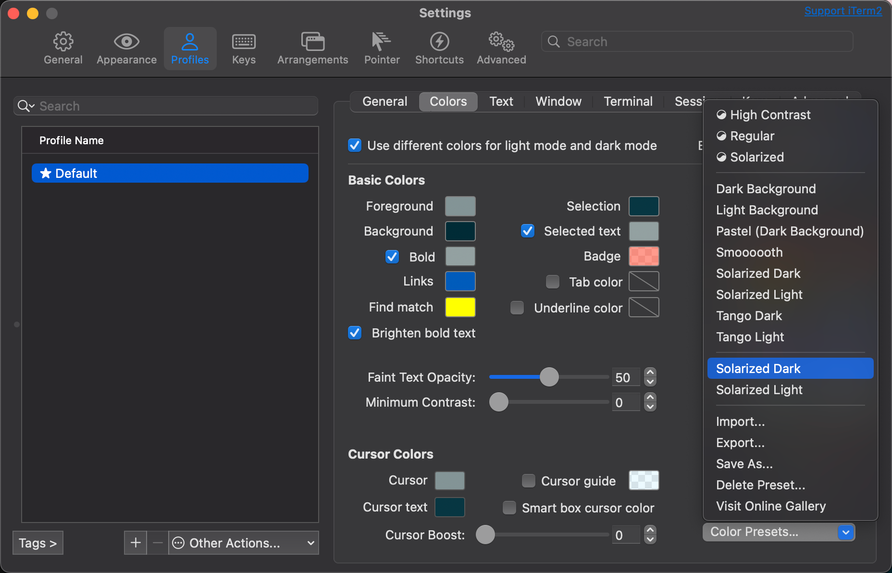

导入之前解压好的文件夹中的 `Solarized Dark.itermcolors` 文件，导入完成后并不会自动更换，需要手动选择更换。

## 安装自动命令提示插件

在 iTerm 2 中输入：

```shell
cd ~/.oh-my-zsh/custom/plugins
git clone https://github.com/zsh-users/zsh-autosuggestions ${ZSH_CUSTOM:-~/.oh-my-zsh/custom}/plugins/zsh-autosuggestions
```

一目了然，这一步是为了将 zsh-autosuggestions 插件下载到 oh-my-zsh 到插件目录下。

输入 `vim ~/.zshrc`，找到 plugins 一行，默认是这样：

`plugins=(git)`

将其修改为：

`plugins=(git zsh-autosuggestions)`

到这里 zsh-autosuggestions 插件就已经安装完了，重启 iTerm2 即可生效。

PS：细心的朋友可能会发现自动命令提示有一些问题，我会在后文提供解决方案。

## 安装语法高亮插件

这里使用 Homebrew 安装 zsh-syntax-highlighting 插件，没装 Homebrew 的可以参考这篇文章安装：[mac下高效安装 homebrew 及完美避坑姿势](https://www.cnblogs.com/joyce33/p/13376752.html)

`brew install zsh-syntax-highlighting`

安装完成后注意会提示一个命令，形如：

`source /usr/local/share/zsh-syntax-highlighting/zsh-syntax-highlighting.zsh`

然后还是 `vim ~/.zshrc` 打开配置文件，将刚刚提示的命令插入配置文件中。

输入命令加载插件：

`source ~/.zshrc`

或者
```bash
cd ~/.oh-my-zsh/custom/plugins
git clone https://github.com/zsh-users/zsh-syntax-highlighting.git ${ZSH_CUSTOM:-~/.oh-my-zsh/custom}/plugins/zsh-syntax-highlighting
```

# 给 Vim 及 ls 配色

## 配置 Vim 颜色

用 cd 命令移动到之前下载解压好的 solarized 文件夹的 /solarized/vim-colors-solarized/colors 目录，输入：

```shell
mkdir -p ~/.vim/colors 
cp solarized.vim ~/.vim/colors/
```

输入 `vim ~/.vimrc` 打开vim配置文件，插入以下三行配置：

```shell
syntax enable
set background=dark
colorscheme solarized
```

## 配置 ls 颜色

推荐安装 lsd ： `brew install lsd` ，安装即可使用，默认配置就够用了，需要注意 lsd 包含有特殊符号，推荐使用 nerd font 字体

这部分就很简单了，老样子 `vim ~/.zshrc` 打开配置文件，插入：

```shell
# 配置 ls 颜色
export CLICOLOR=1
export LS_COLORS="di=34:ln=35:so=32:pi=33:ex=31:bd=34;46:cd=34;43:su=30;41:sg=30;46:tw=30;42:ow=30;43"
```

**注意将该命令置于底端，不然可能会被覆盖而无法正确执行**  
配色方案可自定义，具体来说就是通过修改 LS_COLORS 后的内容进行修改，想要自定义颜色的[点这里](https://geoff.greer.fm/lscolors/)。


### 安装 LS_COLORS

LS_COLORS 包含有对不同颜色的配置，效果如下图所示

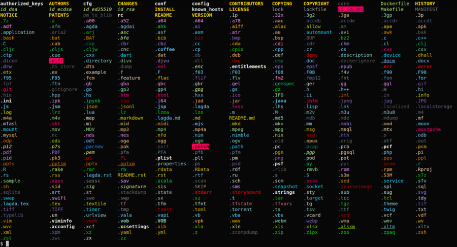

下载项目
`git clone https://github.com/trapd00r/LS_COLORS ~/Project/LS_COLORS/`

在 `~/.zshrc` 中增加一行配置

```
# 配置 ls 颜色
source ~/Project/LS_COLORS/lscolors.sh
```

# 调整 iTerm2 及 Status Bar 设置

打开 iTerm2 设置，`Profiles -> Session -> Miscellaneous`，勾选底部的 `Status bar enabled`。  
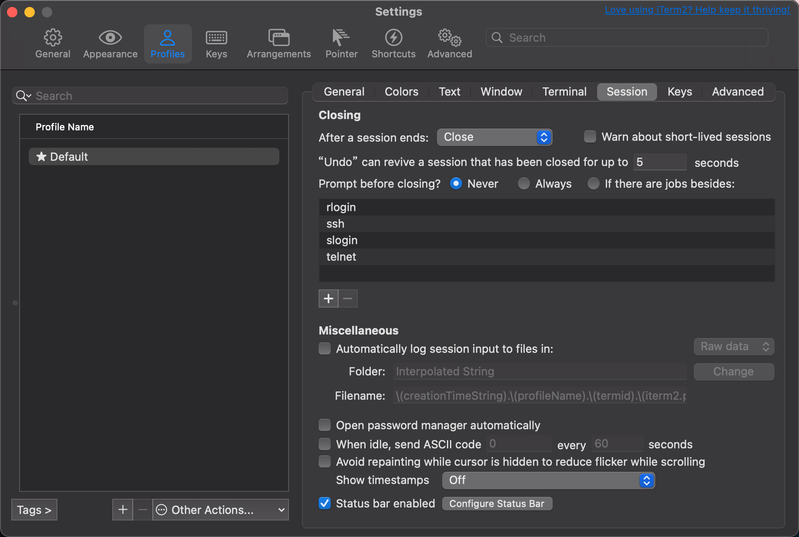
点击旁边的 Configure Status Bar  
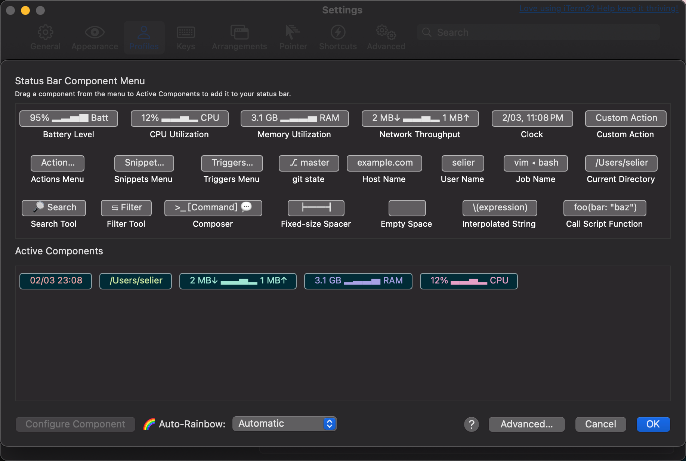
选择你想要添加的 Component，然后把底部的 `🌈Auto-Rainbow` 选项设为自动。

接下来进入 Appearance 选项卡，在 General 中将 Theme 修改为 Minimal 以实现顶栏沉浸的效果，再将 Status bar location 选择为 Bottom，让其在底部显示。  
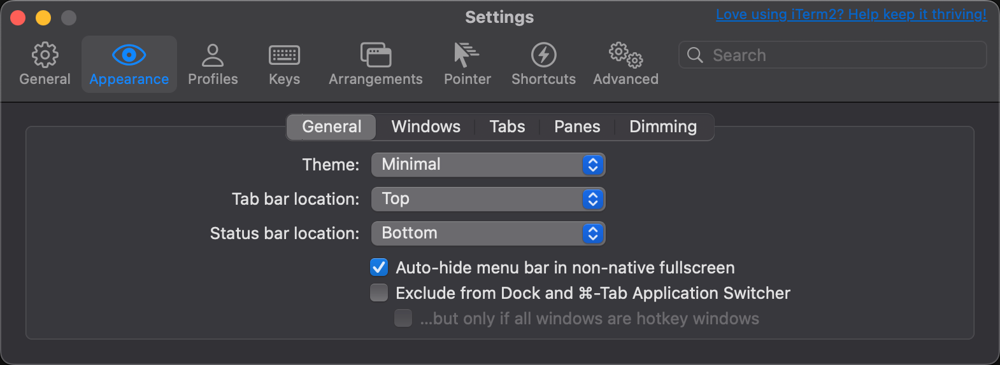
可能还有写朋友记得我之前提到过自动命令提示有些问题，这里有一个小坑，即自动弹出的提示颜色和背景颜色完全一致，导致根本看不见命令提示，知道了问题所在解决起来就很简单了，直接在 `Profiles -> Color -> ANSI Colors` 中修改 Black 行 Bright 列的颜色即可。  
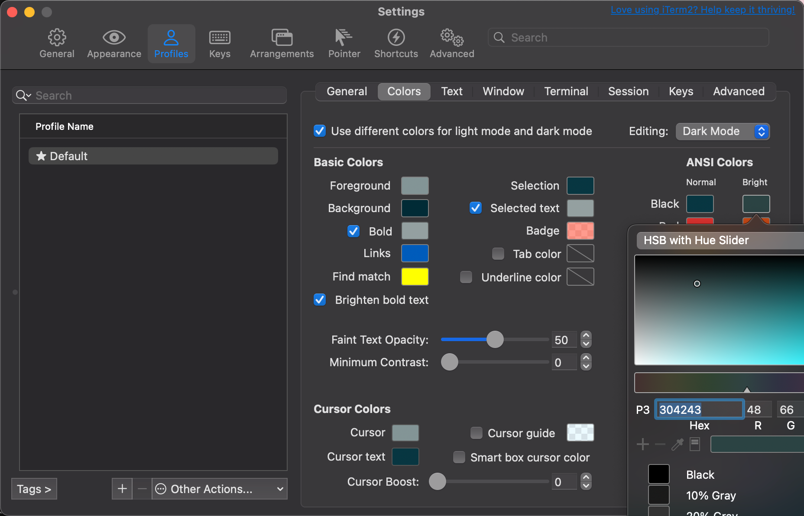
但是——这里要说但是——请注意，Vim 的配色也是与之有关的，结果便是如果修改的颜色过于明亮就会导致在 Vim 中看不清字，这里我的解决方法比较简单粗暴，找了一个既能看得清也不至于遮挡字的颜色，我用的是 `304243`

到此为止所有的配置就结束了，有些配置可能需要重启 iTerm 才能生效，无论如何，enjoy it!

# 增加终端快捷键
路径：`Setting -> Profiles -> Keys -> Key Mappings`

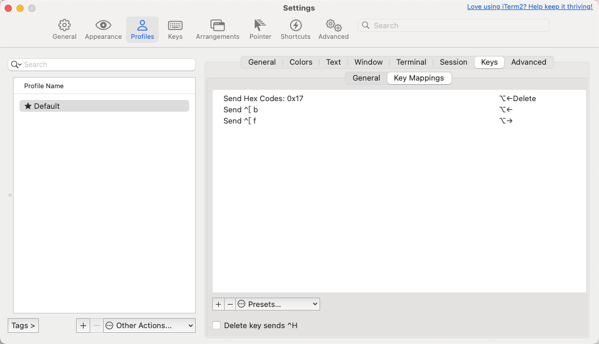

点击 "+"按钮添加一个新的按键映射，或者双击现有的按键映射来编辑它。对于 "跳到单词开头 "命令，选择 "发送转义序列 "动作并发送转义序列`Esc+b` 。
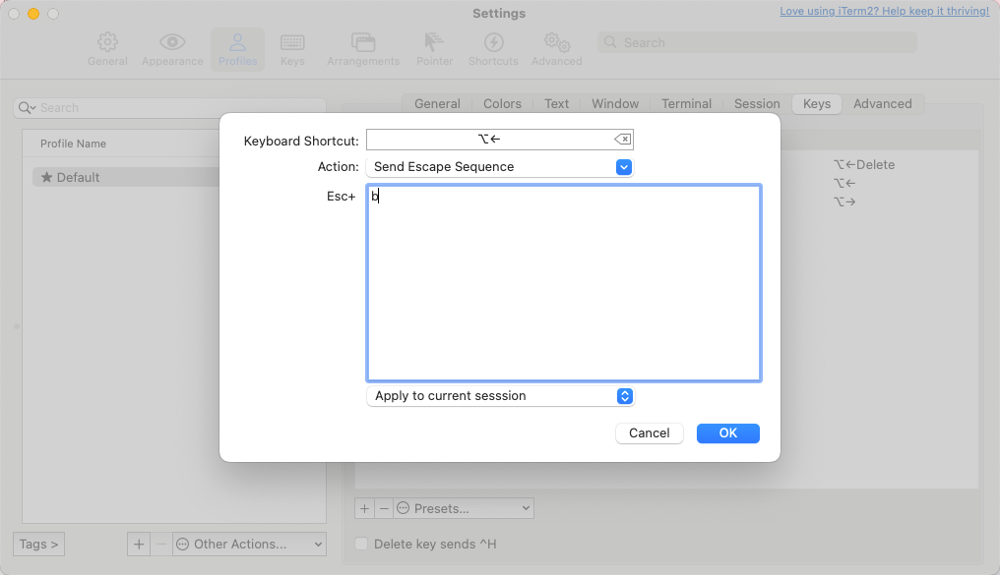

现在，每当你在iTerm2中输入一个命令时，真的很容易跳回到单词（甚至是多个单词）的开头，以插入更多的文字或删除命令的一部分--不再需要反复按←键来逐字导航。

下面是我为各种跳转和删除命令配置的全部键盘快捷键列表。

|快捷方式|命令|动作|发送|
|---|---|---|---|
|⌥←|跳到字的开头|发送逃逸序列|`b`|
|⌥→|跳到字的末尾|发送逃逸序列|`f`|
|⌘←|跳到行的开头|发送十六进制代码|`0x01`|
|⌘→|跳到行尾|发送十六进制代码|`0x05`|
|⌥⌫|删除到字的开头|发送十六进制代码|`0x17`|
|⌘⌫|删除整行|发送十六进制代码|`0x15`|

  

# 总结

说实话，一个简单的 iTerm2 配置，里面的坑还是有不少的，我也是有了前几次的经验才找到了一套相对好用的方案，从这个角度来说每次忘记备份配置也许不算坏事，~~但是我也不想再经历一次了~~，总之希望对你能有所帮助。

参考：

[ITerm2配置-让你的mac命令行更加丰富高效](https://www.jianshu.com/p/405956cdaca6)

[iTerm2 配置和美化](https://sspai.com/post/63241)

**注：安装 iTerm2 一节中出现的图取自 [iTerm2 官网](https://iterm2.com/)，版权归 iTerm2 官方所有。**

[iTerm2 配置详解——打造赏心悦目且易用的 Mac 终端](https://sonatta.top/post/6QTYAEfdJ/)